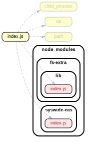

# Developer Documentation

This documentation includes the implementation details of Auto Encrypt Localhost and is intended to aid you if you’re trying to improve, debug, or get a deeper understanding of Auto Encrypt.

If you just want to use Auto Encrypt Localhost, please see the public API, as documented in the [README](readme.md).

## Like this? Fund us!

[Small Technology Foundation](https://small-tech.org) is a tiny, independent not-for-profit.

We exist in part thanks to patronage by people like you. If you share [our vision](https://small-tech.org/about/#small-technology) and want to support our work, please [become a patron or donate to us](https://small-tech.org/fund-us) today and help us continue to exist.

## Requirements

Auto Encrypt Localhost is supported on:

  - __Node:__ LTS (currently 14.16.0).
  - __ECMAScript:__ [ES2019](https://node.green/#ES2019)

## Overview of relationships



__Not shown (for clarity):__ third-party Node modules, the `util` namespace with helper modules – for logging, error handling, and an async `forEach` implementation – and the `typedefs` namespace with JSDoc type definitions.

Generated using [dependency cruiser](https://github.com/sverweij/dependency-cruiser).

To run dependecy cruiser, you will need to [install Graphviz](https://graphviz.org/download/).

## How it works in more detail

Auto Encrypt Localhost is a Node.js wrapper for [mkcert](https://github.com/FiloSottile/mkcert/) that:

  * Downloads and uses correct mkcert release binary for you machine on Linux, macOS, and Windows.

  * Automatically installs the _certutil_ (nss) dependency on Linux on systems with apt, pacman, yum (untested) and  and on macOS if you have [Homebrew](https://brew.sh) or [MacPorts](https://www.macports.org/) (untested).

  * Creates a root Certificate Authority.

  * Creates locally-trusted TLS certificates for localhost, 127.0.0.1, and ::1.

You can use these certificates for local development without triggering self-signed certificate errors.

For more details on how Auto Encrypt Localhost works behind the scenes, please [see the mkcert README](https://github.com/FiloSottile/mkcert/blob/master/README.md).

## Tests

```sh
npm -s test
```

To see debug output, run `npm -s run test-debug` instead.

## Coverage

```sh
npm -s run coverage
```

To see debug output, run `npm -s run coverage-debug` instead.

## Documentation

To regenerate the dependency diagram and this documentation:

```sh
npm -s run generate-developer-documentation
```

<a name="module_@small-tech/auto-encrypt-localhost"></a>

## @small-tech/auto-encrypt-localhost
Automatically provisions and installs locally-trusted TLS certificates for Node.js® https servers
(including Express.js, etc.) using mkcert.

**License**: AGPLv3 or later.  
**Copyright**: © 2020-2021 Aral Balkan, Small Technology Foundation.  

* [@small-tech/auto-encrypt-localhost](#module_@small-tech/auto-encrypt-localhost)
    * [module.exports](#exp_module_@small-tech/auto-encrypt-localhost--module.exports) ⏏
        * [.https](#module_@small-tech/auto-encrypt-localhost--module.exports.https)
        * [.createServer([options])](#module_@small-tech/auto-encrypt-localhost--module.exports.createServer) ⇒ <code>https.Server</code>

<a name="exp_module_@small-tech/auto-encrypt-localhost--module.exports"></a>

### module.exports ⏏
Auto Encrypt Localhost is a static class. Please do not instantiate.

Use: AutoEncryptLocalhost.https.createServer(…)

**Kind**: Exported class  
<a name="module_@small-tech/auto-encrypt-localhost--module.exports.https"></a>

#### module.exports.https
By aliasing the https property to the AutoEncryptLocalhost static class itself, we enable
people to add AutoEncryptLocalhost to their existing apps by requiring the module
and prefixing their https.createServer(…) line with AutoEncryptLocalhost:

**Kind**: static property of [<code>module.exports</code>](#exp_module_@small-tech/auto-encrypt-localhost--module.exports)  
**Example**  
```js
import AutoEncryptLocalhost from '@small-tech/auto-encrypt-localhost'
const server = AutoEncryptLocalhost.https.createServer()
```
<a name="module_@small-tech/auto-encrypt-localhost--module.exports.createServer"></a>

#### module.exports.createServer([options]) ⇒ <code>https.Server</code>
Automatically provisions trusted development-time (localhost) certificates in Node.js via mkcert.

**Kind**: static method of [<code>module.exports</code>](#exp_module_@small-tech/auto-encrypt-localhost--module.exports)  
**Returns**: <code>https.Server</code> - The server instance returned by Node’s https.createServer() method.  

| Param | Type | Default | Description |
| --- | --- | --- | --- |
| [options] | <code>Object</code> |  | Optional HTTPS options object with optional additional                                           Auto Encrypt-specific configuration settings. |
| [options.settingsPath] | <code>String</code> | <code>~/.small-tech.org/auto-encrypt-localhost/</code> | Custom path to save the certificate and private key to. |


## Like this? Fund us!

[Small Technology Foundation](https://small-tech.org) is a tiny, independent not-for-profit.

We exist in part thanks to patronage by people like you. If you share [our vision](https://small-tech.org/about/#small-technology) and want to support our work, please [become a patron or donate to us](https://small-tech.org/fund-us) today and help us continue to exist.

## Copyright

&copy; 2019-2021 [Aral Balkan](https://ar.al), [Small Technology Foundation](https://small-tech.org).

## License

[AGPL version 3.0 or later.](https://www.gnu.org/licenses/agpl-3.0.en.html)
